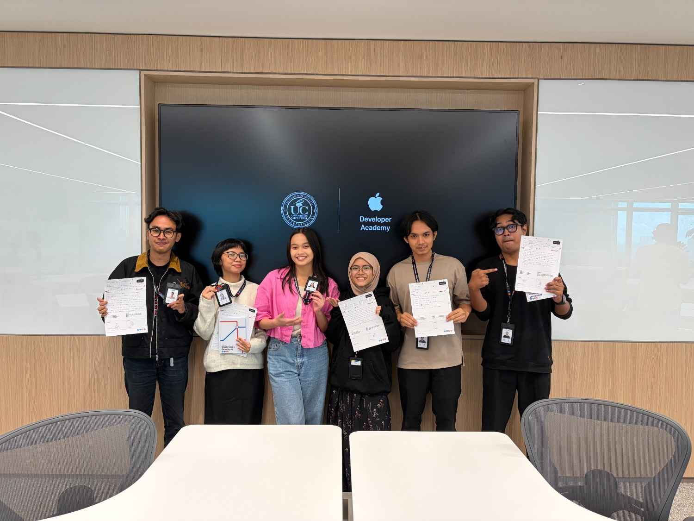
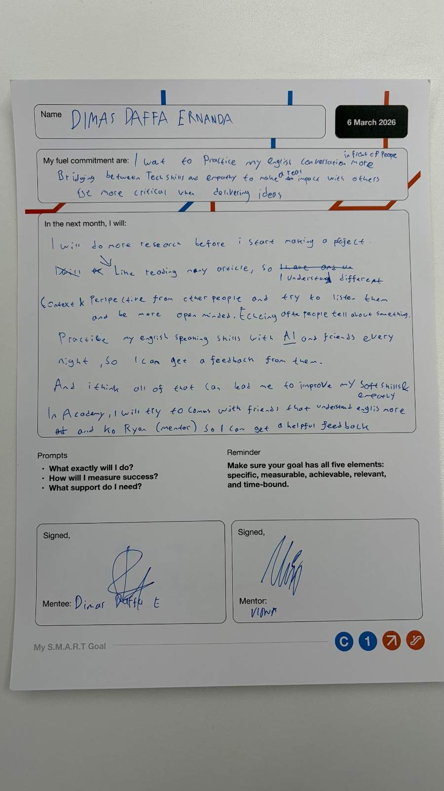

# Day 05: Ready to Depart & The Commitment

**Date:** March 6, 2026

## Activities

- **Individual Mentor Meetup:** Sesi diskusi personal untuk menyelaraskan ekspektasi awal.
- **SMART Goal Setting:** Menyusun komitmen belajar untuk satu bulan ke depan.
- **Crew Meeting (Townhall):** Sesi tanya jawab terbuka tanpa penghakiman (*no judgment*) mengenai perjalanan di Academy ke depannya.
- **Fuel Postcard:** Membuat kartu pos berisi pesan untuk diri sendiri yang akan dibuka pada bulan Desember mendatang.

## My SMART Goals & Commitment

Saya telah menetapkan beberapa target utama untuk satu bulan ke depan:

1. **English Proficiency:** Berlatih percakapan bahasa Inggris di depan umum dan meluangkan waktu 1 jam setiap malam untuk berlatih bersama AI atau teman.
2. **Strategic Bridging:** Menghubungkan kemampuan teknis dengan empati untuk menciptakan dampak nyata bagi orang lain.
3. **Critical Thinking:** Menjadi lebih kritis dan berlandaskan kuat saat menyampaikan ide.

## Action Plan (What I Will Do)

- **Deep Research:** Melakukan riset mendalam (membaca berbagai artikel) sebelum memulai proyek agar memahami berbagai konteks dan perspektif.
- **Active Listening:** Menjadi lebih *open-minded* dan menerapkan teknik *echoing* (mengulang/merangkum) apa yang dikatakan orang lain untuk memastikan pemahaman.
- **Feedback Loop:** Mencari umpan balik langsung dari teman yang lebih mahir berbahasa Inggris serta dari Ko Ryan (mentor) selama di Academy.

## Reflection

Hari ini menandai berakhirnya masa *Prelude*. Sesi *Townhall* tadi memberikan gambaran bahwa Academy adalah ruang aman untuk bertanya dan bereksplorasi. Berbagi komitmen dengan tim dan mentor membuat saya merasa memiliki tanggung jawab lebih untuk tumbuh. Menulis kartu pos untuk diri saya di bulan Desember nanti menjadi pengingat bahwa perjalanan ini adalah tentang konsistensi. Saya siap melangkah dari seorang pengamat menjadi seorang "Crew" yang aktif berkontribusi.

---

