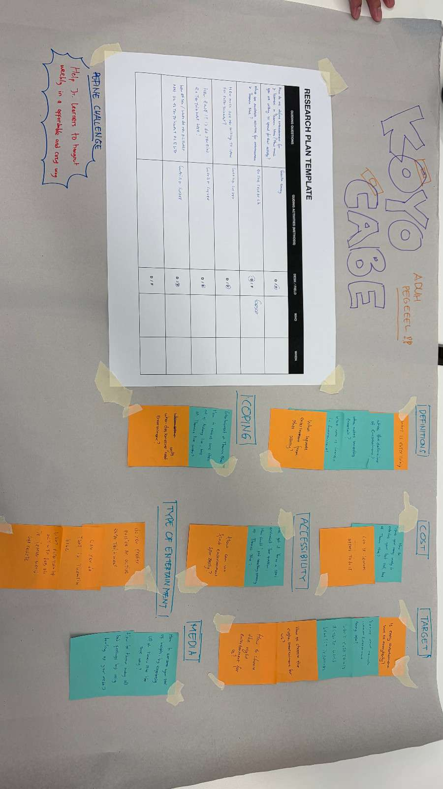

# Day 06: Refined Challenge Statement (Day 1 of Challenge 0 - Hacking Thamrin Nine)

**Date:** Monday, March 9, 2026

## Activities

- **Challenge 0 Introduction:** Memahami objektif, batasan, dan lini masa proyek selama 8 hari kerja ke depan.
- **Team Agreement:** Membangun kesepakatan internal kelompok dalam mengelola tugas dan komunikasi.
- **Refining Challenge Statement:** Memfokuskan riset pada aspek **Entertainment** di area Thamrin Nine.
- **Quick Survey Design:** Menyusun pertanyaan survei awal untuk menangkap perspektif orang lain mengenai hiburan.
- **Research Planning:** Menentukan *Guiding Questions* (GQ) dan *Guiding Activities* (GA) untuk proses investigasi besok.

## Key Survey Insights (The "Why")

Kelompok kami merumuskan beberapa poin krusial untuk menggali data objektif:

- **Definition:** Mencari tahu ragam aktivitas hiburan menurut audiens.
- **Preference:** Mengidentifikasi jenis hiburan di Thamrin Nine yang diminati beserta alasannya.
- **Budgeting:** Mengukur daya beli atau *willingness to spend* audiens untuk hiburan.
- **Accessibility:** Mengevaluasi kemudahan akses informasi hiburan (seperti *information center*).
- **Frequency:** Mengetahui kapan dan seberapa sering audiens merasa membutuhkan aktivitas hiburan.

## Key Learning

- **Avoiding Assumptions:** Belajar untuk tidak langsung menyimpulkan apa itu "hiburan" hanya dari sudut pandang pribadi, terutama karena banyak dari kita yang bukan berasal dari area ini.
- **Critical Questioning:** Belajar menyusun pertanyaan yang tajam agar hasil riset plan besok memberikan data yang valid dan bisa diproses.
- **Structure over Chaos:** Dengan deadline 8 hari kerja, perencanaan riset (*Research Plan*) di hari pertama sangat menentukan efisiensi kerja tim ke depannya.

## Reflection

Hari ini saya belajar bahwa tantangan terbesar dalam memulai sebuah proyek adalah **memvalidasi asumsi**. Tema *Entertainment* mungkin terdengar luas, namun melalui proses *refining*, kami mulai menemukan batasan yang jelas. Saya menyadari bahwa riset bukan hanya soal bertanya, tapi soal memahami kebutuhan orang lain secara mendalam agar solusi yang nantinya dibuat benar-benar memberikan dampak (*impact*).

---
