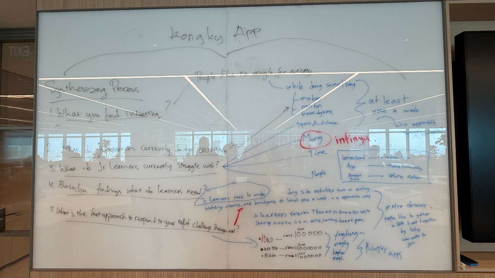
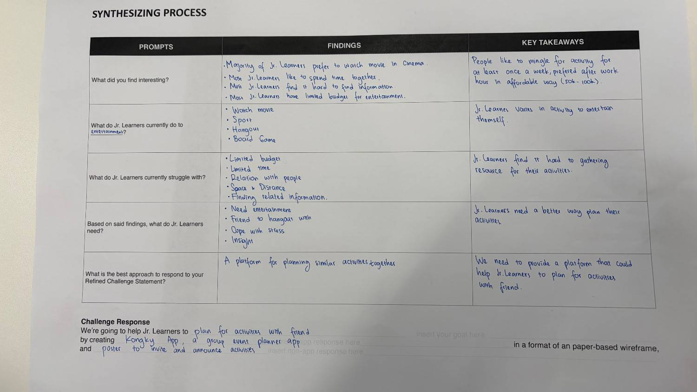

# Day 08: Synthesize Results & Challenge Response (Day 3 of Challenge 0 - Hacking Thamrin Nine)

**Date:** Wednesday, March 11, 2026

## Activities

- **Synthesizing Process:** Mengolah semua temuan dari hasil wawancara dan observasi di lingkungan Jr. Learners.
- **Identifying Key Takeaways:** Menarik kesimpulan utama dari pola perilaku dan hambatan yang dialami audiens.
- **Formulating Challenge Response:** Menentukan solusi akhir yang akan dikembangkan berdasarkan temuan riset.

## Synthesizing Findings & Takeaways

Berdasarkan proses sintesis, berikut adalah poin-poin penting yang ditemukan:

- **What Jr. Learners do:** Mereka suka menonton film, berolahraga, _hangout_, dan bermain _board game_.
- **Interesting Findings:** Mayoritas Jr. Learners lebih suka menonton di bioskop, senang menghabiskan waktu bersama, namun merasa sulit mencari informasi hiburan dan memiliki budget terbatas.
- **Key Takeaways:**
  - Orang-orang ingin berkumpul setidaknya seminggu sekali, terutama setelah jam kerja, dengan cara yang terjangkau (Rp50rb - Rp100rb).
  - Jr. Learners membutuhkan cara yang lebih baik untuk merencanakan aktivitas mereka karena sulitnya mengumpulkan sumber daya informasi.

## Challenge Response: "Kongky App"

Sebagai solusi atas masalah sulitnya koordinasi dan pencarian informasi, tim kami memutuskan untuk membuat:

> **"Kongky App": Sebuah aplikasi _group event planner_ untuk membantu Jr. Learners merencanakan aktivitas bersama teman-teman secara lebih mudah.**

Solusi ini akan diwujudkan dalam format **paper-based wireframe** dan poster untuk mengajak serta mengumumkan aktivitas tersebut.

> **Serta Poster template to invite and announce activity dimana kita bisa buat activity pakai sticky notes lalu templekan pada poster tersebut**

## Key Learning

- **Data Synthesis:** Saya belajar bahwa mengumpulkan data saja tidak cukup; tantangan sebenarnya adalah menemukan "benang merah" di antara jawaban yang beragam untuk menemukan masalah yang paling valid.
- **Empathy in Solution:** Dengan memahami bahwa budget Jr. Learners terbatas dan mereka merasa sulit mencari informasi, kami belajar untuk mendesain solusi yang praktis dan solutif, bukan sekadar canggih.
- **Planning is Key:** Ternyata masalah utamanya bukan pada "kurangnya hiburan", tapi pada "sulitnya merencanakan" hiburan tersebut bersama orang lain.

## Reflection

Hari ini saya menyadari betapa pentingnya fase sintesis. Tanpa proses ini, kita mungkin akan membuat solusi yang salah sasaran. Melihat bagaimana ide "Kongky App" lahir dari kebutuhan teman-teman akan perencanaan yang lebih mudah membuat saya lebih semangat. Ternyata, ide terbaik datang dari usaha kita mendengarkan kesulitan orang lain dan mencoba memberikan jalan keluar yang paling sederhana namun berdampak.

---

