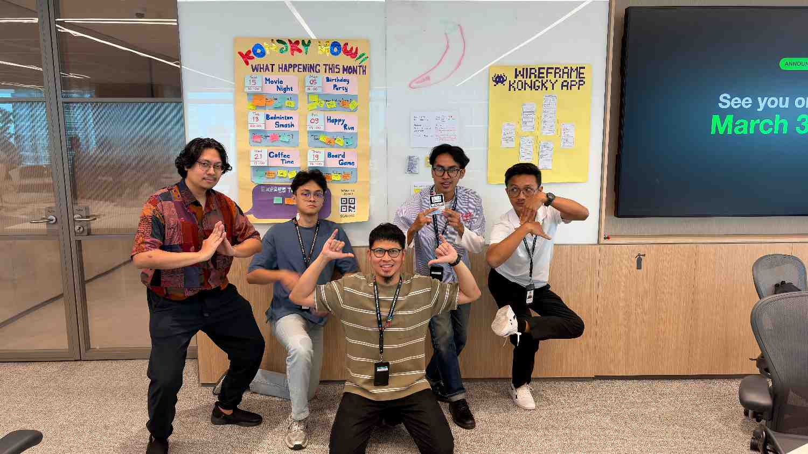
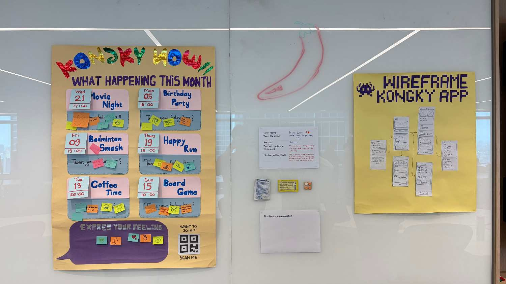
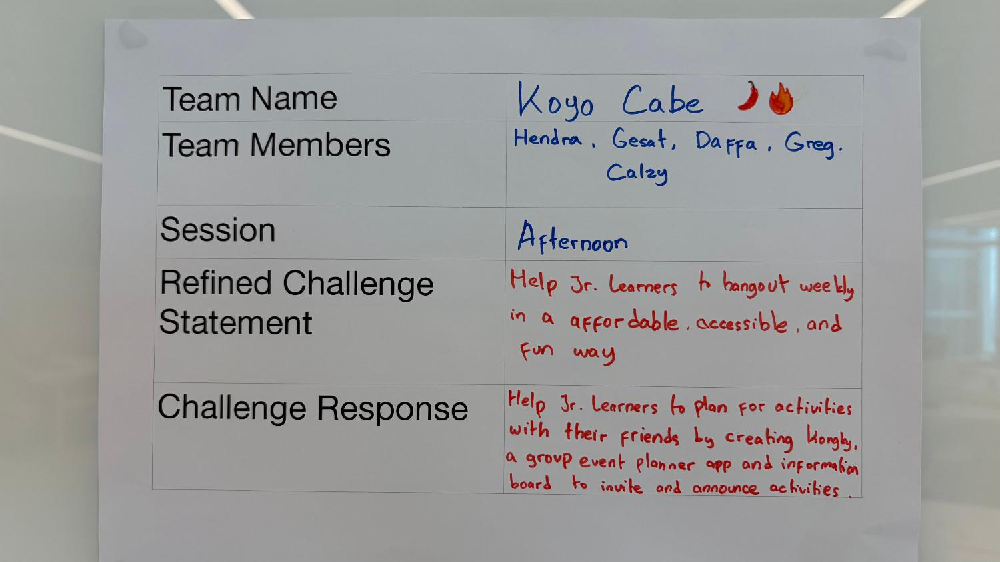
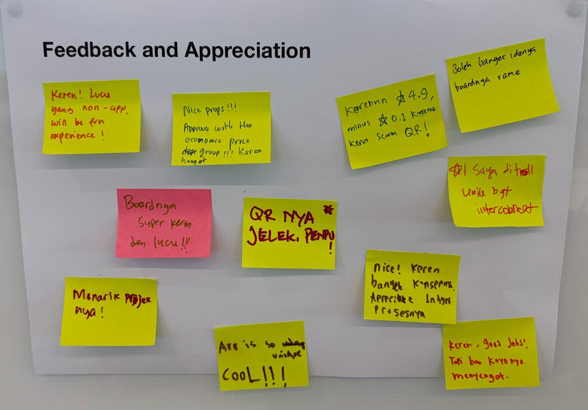

# Day 13: Gallery Walk Final Day (Day 8 of Challenge 0 - Hacking Thamrin Nine)

**Date:** Wednesday, March 18, 2026

## Activities

- **Gallery Walk Preparation:** Menyiapkan stan dan seluruh aset fisik di Taruma Lab.
- **Gallery Walk & Showcase:** Mempresentasikan hasil akhir *wireframe* dan poster "Kongky App" kepada pengunjung yang datang ke stan kami.
- **Sharing Session in Triads:** Berbagi perjalanan belajar selama Challenge 0 dalam kelompok kecil (Triads).
- **Group Retrospective:** Sesi refleksi akhir bersama mentor mengenai pertumbuhan tim selama 8 hari kerja.

## The "Koyo Cabe" Gimmick & Presentation Style

Alih-alih presentasi formal di depan semua audiens, kami melakukan presentasi di stan sendiri saat orang-orang datang berkunjung. Kami menggunakan **gimmick "Koyo Cabe"** sebagai elemen hiburan untuk menarik perhatian dan mencairkan suasana. Hal ini terbukti efektif membuat interaksi menjadi lebih santai dan tidak kaku.

## Key Learning

- **Managing Presentation Anxiety:** Saya belajar bahwa kita tidak perlu panik berlebihan dalam menyiapkan presentasi formal di depan banyak orang yang seringkali membuat gugup. Fokus utama seharusnya tetap pada kualitas konten yang kita bawakan dan bagaimana cara kita menyampaikannya secara personal.
- **Team Dynamics:** Tim ini sangat seru karena adanya *gimmick* yang mencegah kami menjadi terlalu kaku atau "baper" (terbawa perasaan) saat bekerja. Namun, tim tetap mampu menjaga profesionalisme dengan tetap **stick to the goals** setiap kali melakukan diskusi serius.
- **Process over Result:** Melalui sesi Triads, saya menyadari bahwa *struggle* saya dalam memahami frasa baru seperti *Guiding Questions* adalah bagian penting dari proses melepaskan kebiasaan "langsung ke solusi".

## Reflection

Hari ini adalah penutup yang manis untuk Challenge 0. Saya menyadari bahwa sebuah presentasi yang sukses tidak selalu harus formal; terkadang sedikit kreativitas dan humor bisa membuat pesan kita lebih membekas di hati audiens. Saya sangat bersyukur memiliki tim yang bisa menyeimbangkan antara keseruan dan target kerja. Pengalaman ini memberikan rasa percaya diri baru bahwa saya bisa menghadapi tantangan berikutnya di Academy dengan mental yang lebih siap dan terbuka.

---

## Challenge 0 Status: COMPLETED ✅

- **Solution:** Kongky App (Group Event Planner)
- **Output:** Paper-based Wireframe & Poster
- **Team:** Daffa, Calzy, Hendra, Gesat, Greg

