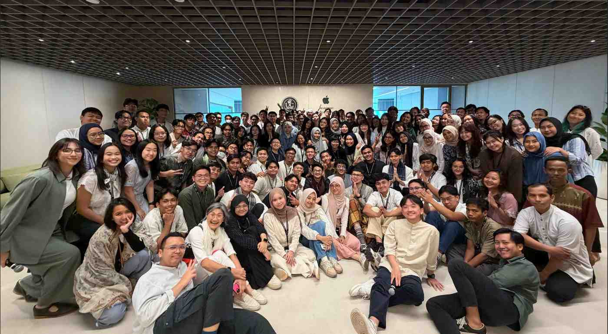

## # Day 14: Big Idea, Essential Question, Challenge Statement (Day 1 of Challenge 1 - Back to Basics)
**Date:** Monday, March 30, 2026

### # Activities
* **Halal Bi Halal:** Sesi silaturahmi setelah libur Lebaran bersama seluruh keluarga besar Apple Developer Academy Jakarta.
* **Challenge 1 Kick-off:** Pengenalan tema besar tantangan pertama: **"Courage"**.
* **Team Formation:** Pembentukan kelompok baru untuk menghadapi Challenge 1.
* **Retrospective Team Agreement:** Menyusun kesepakatan tim baru berdasarkan evaluasi kesalahan dari Challenge 0.

### # Learning from the Past: Challenge 0 Retrospective
Sebelum melangkah ke depan, kami melakukan refleksi mendalam tentang apa yang terjadi di Challenge 0 untuk mencegah *damage* yang sama terulang kembali:
* **The Damage Taken:** Mengidentifikasi hambatan komunikasi atau teknis yang sempat membuat tim sebelumnya kurang efektif.
* **Mistake Analysis:** Menelaah di mana letak kesalahan koordinasi atau manajemen ekspektasi yang pernah terjadi.
* **Recovery Plan:** Menyusun strategi konkret tentang bagaimana tim harus bersikap jika terjadi konflik atau jika ritme kerja tim mulai menurun (*broken*).

### # Key Learning
* **The Warmth of Community:** Sesi Halal Bi Halal mengingatkan saya bahwa di Academy, aspek manusia dan kebersamaan adalah fondasi sebelum kita masuk ke aspek teknis.
* **Courage to Reflect:** Dibutuhkan keberanian (*courage*) untuk mengakui kesalahan di Challenge 0. Tanpa pengakuan itu, kita tidak bisa membuat *Team Agreement* yang lebih kuat.
* **Resilience:** Belajar bahwa tim yang hebat bukan tim yang tidak pernah punya masalah, tapi tim yang tahu cara **recover** dan bangkit kembali saat situasi sulit.

### # Reflection
Hari ini saya merasa hangatnya kebersamaan di Academy benar-benar memulihkan semangat belajar saya. Memulai Challenge 1 dengan tema "Courage" membuat saya sadar bahwa langkah pertama yang paling berani adalah belajar dari kegagalan kemarin. Saya dan tim baru sudah menyusun *Team Agreement* yang lebih solid, dengan komitmen untuk lebih terbuka dan cepat dalam menangani masalah sebelum menjadi *damage* yang besar.

---

