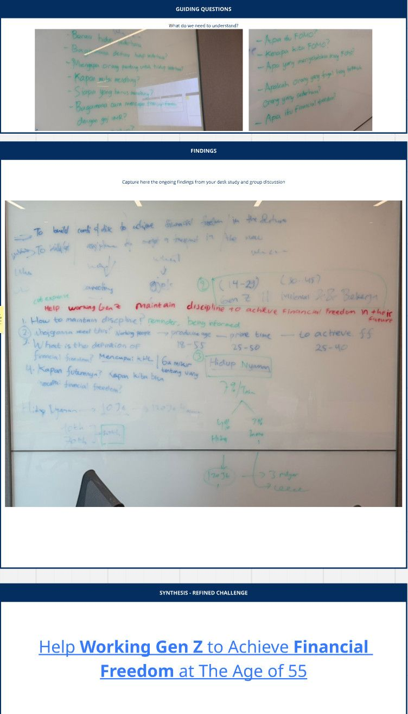

## # Day 16: Challenge to Refined Challenge (Day 3 of Challenge 1 - Back to Basics)
**Date:** Wednesday, April 1, 2026

### # Activities
* **Defining Guiding Questions (GQ):** Membedah pertanyaan riset tentang kebiasaan finansial Gen Z.
* **Initial Synthesis** Menemukan bahwa target jangka panjang (usia 55 tahun) adalah motivasi utama, namun langkah awalnya masih sangat buram.
* **Refining Challenge** Menetapkan "Help Working Gen Z to Achieve Financial Freedom at The Age of 55" sebagai arah besar.

### # Key Learning
Saya belajar bahwa sebuah Challenge Statement yang besar butuh pembatasan fitur (scoping). Keberanian (Courage) di sini adalah berani mengakui bahwa kita tidak bisa menyelesaikan seluruh masalah finansial dunia dalam satu aplikasi, melainkan fokus pada satu masalah spesifik yang paling berdampak.

---
