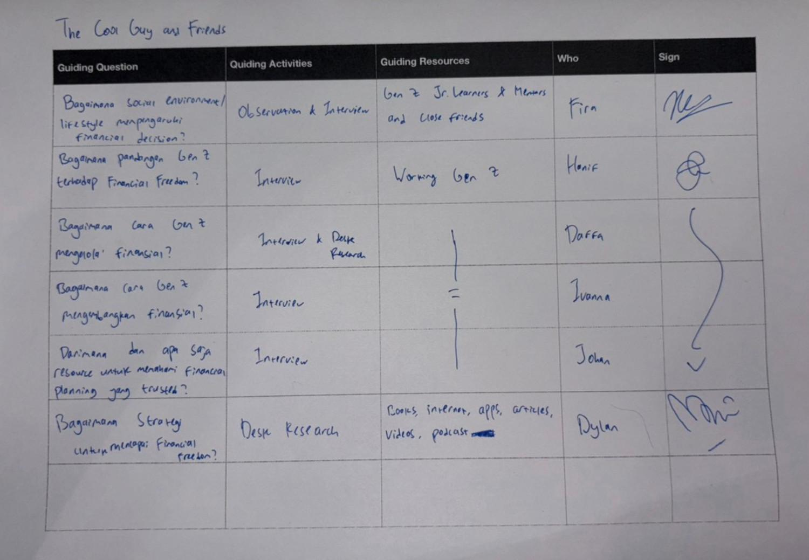

## # Day 17: Research Plan Clinic (Day 4 of Challenge 1 - Back to Basics)
**Date:** Thursday, April 2, 2026

### # Activities
* **Research Plan Clinic:** Melakukan sesi konsultasi mendalam dengan mentor mengenai strategi riset kelompok.
* **Refining Research Methods:** Mempertajam instrumen *Desk Research*, *Interview*, dan *Observation* berdasarkan arahan mentor agar lebih sasar sasaran.
* **Finalizing Guiding Questions (GQ):** Memastikan setiap pertanyaan riset memiliki korelasi langsung dengan tantangan *Financial Freedom* Gen Z.
* **Drafting Interview Questions:** Menyusun daftar pertanyaan wawancara yang mampu menggali *pain points* dan perilaku finansial responden secara jujur.

### # Insights from Clinic
Beberapa poin penting yang kami dapatkan dari sesi klinik hari ini:
* **Scope Validation:** Mentor membantu kami melihat bahwa *Financial Freedom* di usia 55 adalah **tujuan akhir**, namun riset kami harus fokus pada **hambatan saat ini** (misal: kurangnya disiplin atau literasi di usia muda).
* **Effective Interviewing:** Belajar cara bertanya yang tidak menggiring (*leading questions*) agar mendapatkan jawaban yang autentik dari Gen Z mengenai ketakutan finansial mereka.
* **Desk Research Triangulation:** Memastikan data dari internet divalidasi dengan hasil observasi nyata di lapangan.

### # Key Learning
* **Mentorship Value:** Saya belajar bahwa pandangan dari pihak eksternal (mentor) sangat efektif untuk memecah kebuntuan diskusi tim yang mulai "muter-muter".
* **Precision in Inquiry:** Keberanian (*Courage*) hari ini ditunjukkan dengan berani merombak pertanyaan riset yang dianggap terlalu umum menjadi lebih spesifik dan teknis.
* **Structured Preparation:** Dengan *Research Plan* yang matang, fase investigasi besok akan jauh lebih terukur dan tidak lagi berdasarkan asumsi semata.

### # Reflection
Sesi klinik hari ini memberikan rasa percaya diri tambahan bagi tim. Keraguan saya tentang luasnya topik finansial mulai teratasi karena mentor mengarahkan kami untuk fokus pada **perilaku (behavior)** 

---
