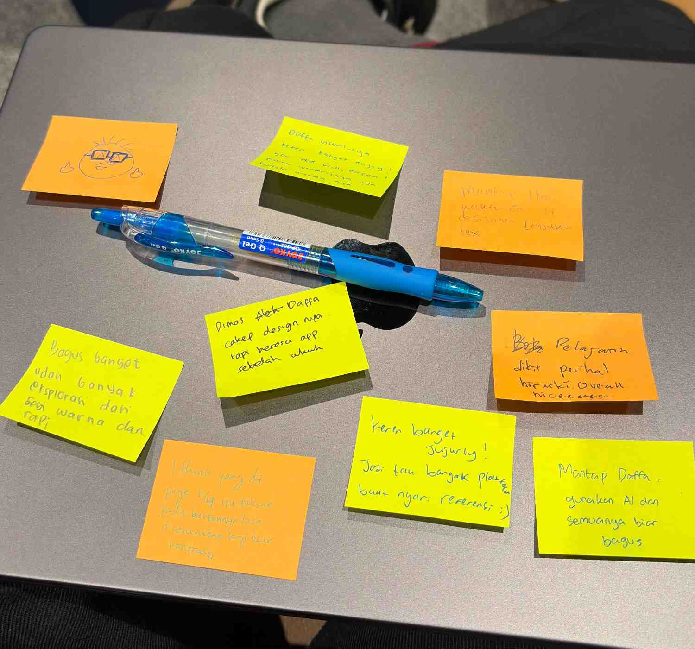

## # Day 27: Feedback Design (Day 14 of Challenge 1 - Back to Basics)
**Date:** Friday, April 17, 2026

### # Activities
* **Internal & External Sharing:** Mempresentasikan draf desain aplikasi kepada kelompok sendiri dan kelompok lain (*Peer Review*).
* **Feedback Collection:** Mengumpulkan *sticky notes* berisi masukan, kritik, dan apresiasi dari rekan-rekan.
* **Psychological Shift:** Mengubah rasa ragu (*imposter syndrome*) menjadi rasa percaya diri setelah melihat respons positif audiens.

### # The Power of Peer Feedback
Melihat foto *sticky notes* yang kamu lampirkan, ada beberapa poin menarik yang bisa kita rangkum:
* **Visual & Clarity:** Banyak yang memuji pemilihan warna dan kerapian *layout* desainmu. Ini membuktikan bahwa waktu yang kamu habiskan untuk memahami **Apple HIG** dan *stacking element* di Sketch kemarin membuahkan hasil yang nyata.
* **Design Potential:** Adanya saran untuk "memaksimalkan AI" dan "menyesuaikan kontras" menunjukkan bahwa rekan-rekanmu melihat desainmu sebagai sesuatu yang *high-potential* dan layak untuk terus dikembangkan.
* **Emotional Boost:** Pujian "keren" dan "semangat" dari teman-teman bukan sekadar basa-basi, tetapi bahan bakar mental yang sangat dibutuhkan saat kamu berada di fase transisi dari seorang *pure programmer* menjadi *developer* yang peduli desain.

### # Key Learning
* **Growth Mindset:** Saya menyadari bahwa ketidakyakinan di awal itu manusiawi. Kuncinya adalah keberanian untuk tetap mencoba (*Courage*), dan hasilnya akan divalidasi oleh orang lain.
* **Design is Communication:** Hari ini saya belajar bahwa desain yang baik adalah desain yang bisa "berbicara" sendiri saat dipresentasikan, bahkan saat saya masih baru belajar *tool*-nya.
* **Feedback as a Fuel:** Mengetahui bahwa desain saya bisa menginspirasi orang lain untuk memberikan referensi tambahan membuat saya semakin semangat untuk menyempurnakan fitur *Journaling* dan *Validasi Psikologis* kita.

### # Reflection
Hari ini adalah salah satu titik balik terbaik saya di Academy. Dari yang awalnya "nggak yakin" dengan kemampuan desain sendiri, menjadi sangat *excited* karena desain saya mendapat apresiasi yang tulus. Saya jadi lebih berani untuk bereksperimen dengan elemen visual yang lebih berani ke depannya.

---
