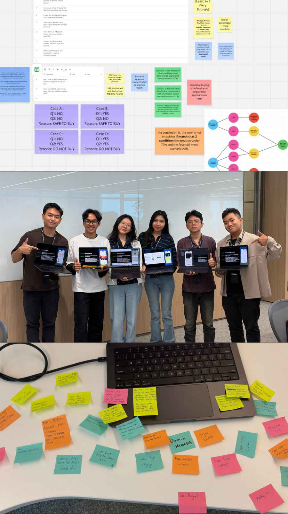

## # Day 31: Last Day Showcase (Day 18 of Challenge 1 - Back to Basics)
**Date:** Thursday, April 23, 2026

### # Activities
* **Tenant Showcase:** Mempresentasikan aplikasi *Anti-Impulsive Buying* di depan mentor, sesama *learners*, dan pengunjung lainnya.
* **Demonstration:** Menunjukkan bagaimana desain yang dikembangkan di Sketch diterjemahkan menjadi kode SwiftUI yang fungsional.
* **Explaining the "Secret Sauce":** Menjelaskan framework algoritma unik yang kamu buat untuk menahan impulsivitas (menggabungkan *delay mechanism* + *journaling* + *validation questions*).

### # Why It Worked (The Winning Formula)
Berdasarkan *feedback* yang kamu terima, ada tiga hal yang membuat presentasimu menonjol:
1. **Solid Foundation (Paperwork):** Banyak orang yang punya ide, tapi kamu membuktikan bahwa ide itu matang karena riset dan *paperwork* yang kuat (seperti yang kita susun di awal).
2. **Algorithmic Courage:** Membuat framework algoritma untuk menahan impulsif adalah nilai plus yang besar. Kamu tidak hanya membuat "tampilan," tapi membuat "sistem" yang memecahkan masalah.
3. **Execution Quality:** Kombinasi antara desain yang memenuhi standar Apple HIG dan implementasi kode SwiftUI yang rapi membuat aplikasi kamu terlihat dan terasa "asli" (seperti produk siap rilis).

### # Key Learning
* **Confidence in Presentation:** Saya belajar bahwa ketika kita *benar-benar memahami* masalah yang kita selesaikan (melalui riset mendalam), cara kita menyampaikannya akan terasa lebih meyakinkan.
* **The Synergy of Skills:** Hari ini membuktikan bahwa kemampuan desain (Sketch) dan kemampuan teknis (SwiftUI) adalah dua sisi mata uang yang harus berjalan beriringan untuk menciptakan produk *world-class*.
* **Validation of Courage:** Keberanian untuk jujur pada *struggle* teknis dan berani melakukan *refactoring* arsitektur kemarin telah membuahkan hasil yang manis hari ini.

### # Reflection
Hari ini adalah momen pembuktian bagi saya. Melihat orang lain terkesan dengan framework algoritma yang saya buat untuk menahan impulsif membuat saya sadar bahwa saya tidak hanya "membuat aplikasi," tapi "menciptakan solusi." Rasa bangga itu muncul bukan karena dipuji, tapi karena saya tahu *tahapan demi tahapan* yang saya lalui—dari sketsa kertas yang berantakan, *struggle* di Sketch, hingga arsitektur SwiftUI yang kompleks—semuanya layak untuk hasil ini.

