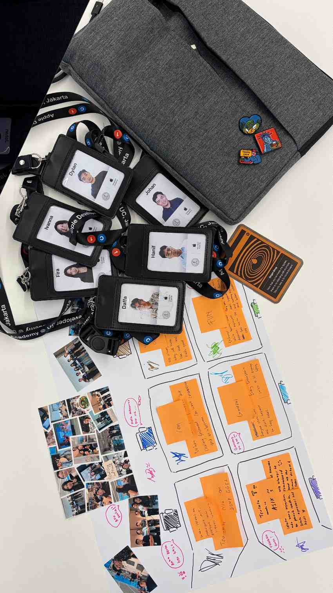
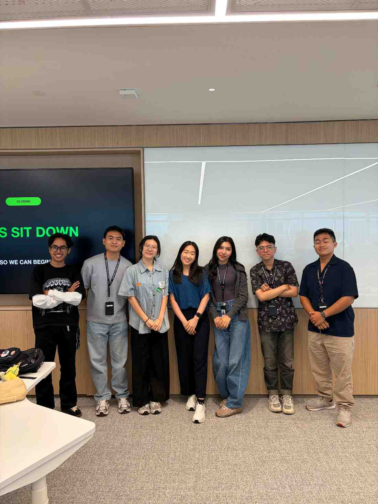

## # Day 32: Reflection with Team (Day 19 of Challenge 1 - Back to Basics)
**Date:** Friday, April 24, 2026

### # Activities
* **Team Canvas Art:** Mencurahkan memori kolektif selama Challenge 1 ke dalam sebuah kanvas fisik, simbol dari kerja keras dan tawa yang dilalui bersama.
* **Emotional User Journey Map:** Menyusun *map* yang merefleksikan "pasang surut" emosi tim—dari kebingungan di awal, frustrasi saat *coding*, hingga kegembiraan saat *showcase*.
* **Team Reflection:** Sesi berbagi kesan pesan yang hangat, mengakui setiap kontribusi anggota dan menguatkan ikatan (*bonding*) sebelum menatap Challenge 2.

### # Insights: The Emotional Journey of Challenge 1
Menyusun *Emotional Journey Map* membantu kami melihat bahwa:
* **The Struggle is Shared:** Rasa ragu (*imposter syndrome*) dan hambatan teknis yang saya alami ternyata dirasakan juga oleh rekan setim. Mengetahui ini membuat saya merasa jauh lebih tenang dan didukung.
* **Victory is Collective:** Keberhasilan *showcase* kemarin adalah hasil dari akumulasi "kemenangan kecil" setiap hari—dari diskusi *rancangan awal* hingga *refactoring kode*.
* **Trust & Growth:** Kami tidak hanya membangun aplikasi, kami membangun rasa percaya. Sesi hari ini membuktikan bahwa *courage* dalam tim bukan hanya soal keberanian teknis, tapi juga keberanian untuk terbuka secara emosional satu sama lain.

### # Key Learning
* **Human-Centered Team:** Saya belajar bahwa tim yang hebat bukan hanya yang pintar secara teknis, tapi yang memiliki *empathy* tinggi terhadap dinamika emosi sesama anggota.
* **Reflective Practice:** *Reflection* adalah bagian dari pembelajaran yang sering terlewatkan. Hari ini saya menyadari bahwa berhenti sejenak untuk mensyukuri proses membuat semangat kami untuk Challenge berikutnya justru semakin membara.
* **Ownership of the Experience:** *Canvas art* yang kami buat akan menjadi pengingat permanen bahwa kami pernah berjuang dan berhasil bersama.

### # Reflection
Hari ini rasanya sangat hangat. Melihat *Emotional Journey Map* kami, saya tersenyum melihat bagaimana kami berhasil menavigasi dari "kebingungan" di awal bulan menjadi "keyakinan" di akhir. Tidak ada lagi keraguan tentang *Financial Freedom* yang luas itu, karena kami sudah membuktikan diri mampu fokus dan menyelesaikan satu masalah spesifik. Kebersamaan ini adalah aset terbesar tim saya.

---

